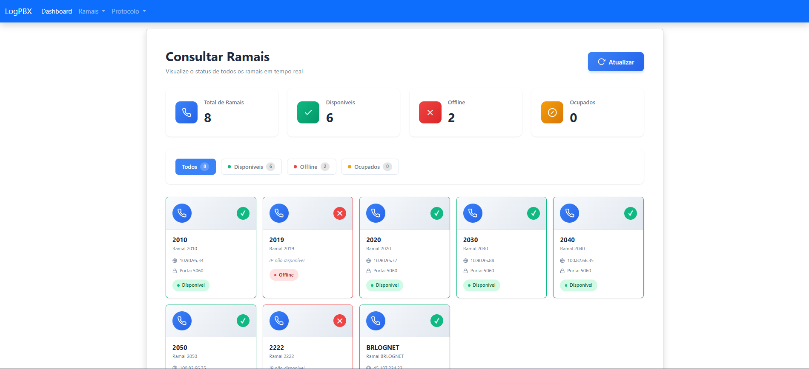
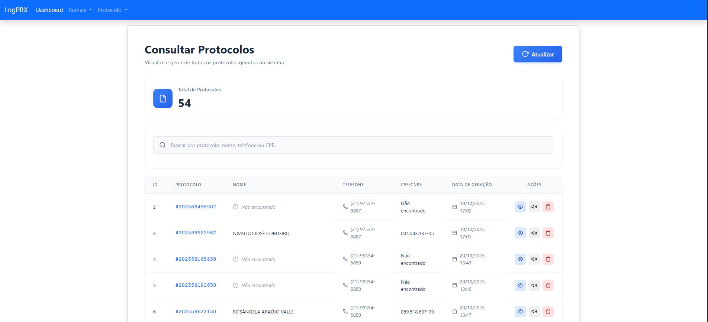

## Angular & Asterisk AMI – Interface Web para Monitoramento

Este projeto apresenta uma aplicação web construída com Angular, projetada para oferecer monitoramento e interação em tempo real com um servidor de telefonia Asterisk. A comunicação com o Asterisk é realizada através do Asterisk Manager Interface (AMI), intermediada por um backend em Java com Spring Boot, que gerencia a comunicação em tempo real com o frontend Angular através de WebSockets.

Trata-se de uma implementação didática que visa demonstrar como integrar tecnologias web modernas com um sistema de telefonia robusto, criando uma interface de gerenciamento ou monitoramento em tempo real. Este projeto foi concebido para atender às necessidades de um provedor de internet que possui servidores PBX VoIP, oferecendo uma ferramenta para monitorar e interagir com sua infraestrutura de telefonia.

⚠️ **Atenção:** Este projeto foi concebido com propósitos estritamente educacionais e de demonstração. Embora funcional, não é otimizado para ambientes de produção e deve ser utilizado apenas para estudo e compreensão das tecnologias envolvidas. O foco principal é a integração e a arquitetura, não a robustez ou segurança para uso em larga escala.

🎯 **Objetivo do Projeto**

Este projeto foi criado com o intuito de explorar e demonstrar a integração de diversas tecnologias, servindo como um estudo de caso prático para:

- **Integração Full-Stack**: Demonstra a comunicação entre um frontend (Angular), o backend (Java com Spring Boot) e um sistema de telefonia (Asterisk).  
- **Asterisk Manager Interface (AMI)**: Explora o uso da AMI para receber eventos em tempo real do Asterisk e enviar comandos, permitindo monitoramento de chamadas, status de agentes, e outras interações.  
- **Comunicação em Tempo Real**: Ilustra a implementação de WebSockets para manter o frontend Angular atualizado com os eventos do Asterisk de forma instantânea, proporcionando uma experiência de usuário dinâmica.  
- **Desenvolvimento Frontend com Angular**: Apresenta a construção de uma interface de usuário reativa e dinâmica para exibir dados de telefonia e interagir com o sistema Asterisk de maneira intuitiva.  
- **Monitoramento para Provedores**: Estudo para construir painéis de controle ou ferramentas de gerenciamento para sistemas de comunicação, útil para provedores de internet com infraestrutura VoIP.  

📸 **Visualização do Projeto**  
A interface do usuário, desenvolvida em Angular, oferece painéis intuitivos para monitorar o status do sistema Asterisk e interagir com suas funcionalidades.

- 📞 *Monitoramento de Ramais:*

Este painel exibe o status em tempo real dos ramais configurados no Asterisk, categorizando-os como disponíveis, offline ou ocupados. Permite uma visão rápida da saúde da sua infraestrutura de telefonia.

- 🗒️ *Consulta e Gerenciamento de Protocolos:*

A seção de protocolos permite visualizar e gerenciar registros de interações ou chamadas geradas pelo sistema, oferecendo funcionalidades de busca e detalhes para cada evento.

